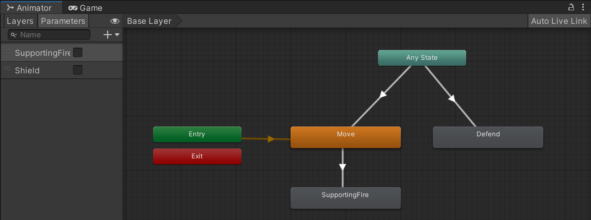
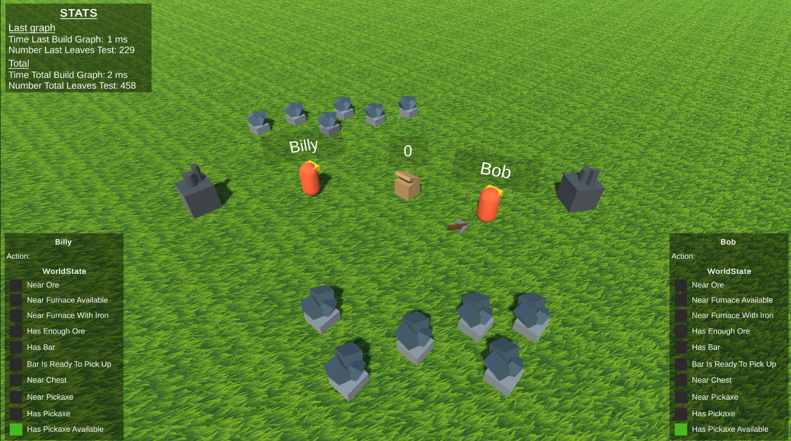

# AI Learning
Project that aims to learn AI programming in game, specifically **Movements, Decisions, Machine Learning and Planner**.<br>
Exercice doing during 3rd year at ISART.

## Table of content ##
 - [Quick Start](#quick-start)
 - [**1. Movement & Decision**](#1-movement--decision)
 - [1.1 Project Description](#11-project-description)
 - [1.2 AI](#12-ai)
 - [**2. Machine Learning**](#2-machine-learning)
 - [2.1 Project Description](#21-project-description)
 - [2.2 Goal](#22-goal)
 - [2.3 Technical Choices](#23-technical-choices)
 - [2.4 Training Sets](#24-training-sets)
 - [2.5 Analysis of result](#25-analysis-of-result)
 - [**3. Planner**](#3-planner)
 - [3.1 Project Description](#31-project-description)
 - [3.2 GOAP Data](#32-goap-data)
 - [Technology](#technology)
 - [Credit](#credit)

## Quick Start ##
1. Clone the project: ``` git clone git@github.com:Vincent-Devine/AI_Learning.git ``` *(by shh)*
2. Open the Unity project
3. Choose the project you want to play going to the righ scene
4. Start the simulation by the ``` Play button ``` on the Unity interface 

For **Machine Learning** scene only, by default, AI is not trained.
In the ```manager's inpector```, you can resertart the training or setup a already trained AI

## 1. Movement & Decision


### 1.1 Project description ##
#### 1.1.1 Instruction ###
Create an NPC AI that can move in squads and interact with the player, as part of a real-time action game.<br>
You'll code an AI that allows an ally NPC to help and support the player in various circumstances.<br>
The NPC must be able to
- follow the player: staying close to the player, slightly behind him or her (adjustable distance)
- support fire: if the player shoots at a point on the map, the NPC must shoot at the same point (left click)
- protect the player: if an enemy shoots at the player, the NPC will go between the enemy and the player, pointing its shield toward the enemy
- heal the player: if the player is seriously wounded, the NPC will heal the player by moving near him and then by triggering a healing action
- cover fire: the player can right-click on an area of the map to request the action, it can be stopped at any time by right-clicking again

#### 1.1.2 Our choices ###
We've deviced to have 4 allies (AI / NPC). Each with a defined position.<br>
A shieldman to protect the player with a shield to reduce bullet damage. <br>
A medic to heal allies when their health points fall below a threshold ( current health <= 5 ).<br>
Two gunmen that will provide cover shots, if requested.<br>
When the allies aren't doing their specific jobs. Allies follow the player in predefined formations (shieldman in front, gunmen on both sides of the player and medic behind). Allies also fire to the same position as the player shoots.<br>

### 1.2 AI ##
#### 1.2.1 Movement ###
We use the **NavMesh Agents of Unity**.<br>

#### 1.2.2 Decision making ###
For the decision-making part of AI, we use the **Finite State Machine (FSM)**. It's a simple system used to manage simple behaviors. <br>
It's a well-known system, it's not only used for AI but also for animations.<br>
Unity already has an FSM system implemented for its *animator*. We've decided to adapt it and use it for our AI. This allows us to have clean, easy-to-read and well-designed graphical interface.<br>



## 2. Machine Learning

### 2.1 Project description ##
Using the MLP you've coded, you will produce a simple learning system of your choice, but in a "video game" context.
 
### 2.2 Goal ##
The aim of my project is to have a functional **AI for a car racing game**. The AI will have to complete a lap of the circuit without touching a wall.

### 2.3 Technical Choices ##
To create my AI, I chose to use a **Neural Network** with with **Genetic Algorithms**.<br>
Thanks to this technique. I simply need to determine a score for each t'entative. Then take the best and the worst, mix them up and start again with a new generation.<br>

As for the neural network. I used a matrix representation, simply to learn a new way of representing a neural network

### 2.4 Training Sets ##
As mentioned above. I need to determine a score for each of my races.<br>
As values that will help me to determine my score, I will have:
- the distance covered
- the average speed
- the distance from walls

And, I multiply each of these values with a value that gives importance to each of this values.<br>
<br>
In my case, the primary objective is to succeed in the race, so I will put a high value on distance covered, as opposed to speed, where I will put a low value.

### 2.5 Analysis of result ##
I managed to get a AI to do a lap without touching a wall.<br>
But, with the same genome, when it does several laps, it doesn't succeed all the time. I think it needs more training.<br>

After more training, it could be interesting to decrease the importance of distance covered and increase the importance of average speed.<br>

## 3. Planner


### 3.1 Project description ##
#### 3.1.1 Instruction ###
 - [x] Use the template given to create your own planner (with effects, action, world state and goal systeme) for a real-time plan execution.
 - [x] To make the planne, use **Forward** search.

### 3.1.2 Bonus ###
 - [x] Witch action has a cost depending the world state.
 - [x] Add agent.
 - [ ] Use **BitArray** to optimize WorldState storage.
 - [ ] Use **Backward** search.

<br>



## 3.2 GOAP Data
### 3.2.1 Goal ###
Add 5 bar in the chest.<br>
To do this:
1. The agent need to mine ore
2. When the agent has 2 ore
3. Craft bar in furnace
4. Store the bar in the chest

To help the agent, there are 1 pickaxe in the world.

### 3.2.2 Conditions list ###
Each condition is calculated in relation to an agent.<br>
- NearOre
- NearFurnaceAvailable
- NearFurnaceWithIron
- HasEnoughOre
- HasBar
- BarIsReadyToPickUp
- NearChest
- NearPickaxe
- hasPickaxe
- HasPickaxeAvailableInWorld

### 3.2.3 Actions list ###
- MoveNearOre
- MineOre
- MoveToAvailableFurnace
- MoveToFurnaceWithIron
- CraftingBar
- TakeBar
- MoveToChest
- StoreBar
- Wait
- MoveNearPickaxe
- TakePickaxe

## Technology ##
- Engine : Unity *2022.3.4f1*
- Text Editor : Visual Studio *2022*
- Versionning : [Github](https://github.com/Vincent-Devine/AI_GOAP)
- Math library *(Machine Learning)* : [MathNet](https://numerics.mathdotnet.com/Matrix)

## Credit ##
Project done at **ISART DIGITAL** <br>
Author : Vincent DEVINE, Kristian GOUPIL (Movement&Decision)<br>
Special thanks : Florian Wolf <br>

### Assets
- [Car](https://assetstore.unity.com/packages/3d/vehicles/land/arcade-free-racing-car-161085) model by **Mena** *(Machine Learning)*

### Date
Movement & Decision project start : 03-10-2023 <br>
Movement & Decision project end : 23-10-2023 <br>

Machine Learning project start : 13-12-2023 <br>
Machine Learning project start : 02-01-2024 <br>

Planner project start : 02-01-2024 <br>
Planner project start : 05-01-2024 <br>